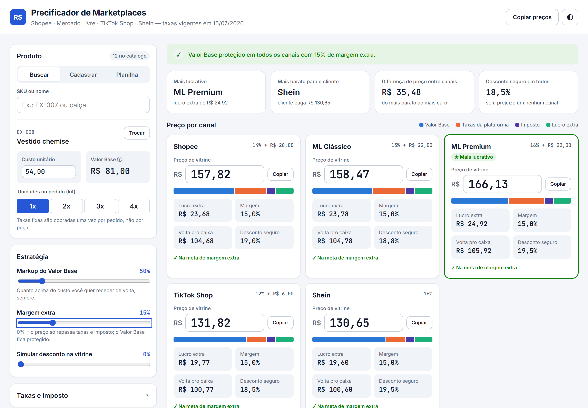
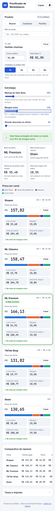
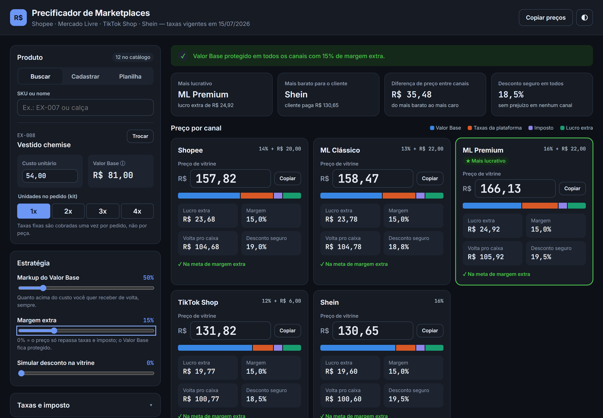

# Precificador de Marketplaces

[](https://github.com/diaquinodev/dashboard-precificacao/actions/workflows/ci.yml)

Dashboard que calcula o **preço de venda certo** para o mesmo produto na **Shopee, Mercado
Livre (Clássico e Premium), TikTok Shop e Shein**, garantindo que comissões, taxas fixas,
frete e imposto nunca comam o custo do vendedor.

**[▶ Abrir a demo](https://diaquinodev.github.io/dashboard-precificacao/)** · roda no navegador,
sem login · dados de exemplo fictícios



## O problema

Quem vende moda em vários marketplaces precisa responder, para cada produto: _"por quanto
anuncio em cada canal para não ter prejuízo?"_. A conta parece simples, mas não é:

- cada canal cobra de um jeito (percentual, valor fixo por item, frete, afiliado);
- a **taxa muda conforme a faixa de preço**, e o preço depende da taxa;
- as regras mudam várias vezes por ano (Shopee em 03/2026, TikTok em 07/2026).

Na planilha, o erro mais comum é calcular com a taxa da faixa errada. Um exemplo real do
motor: para um produto com Valor Base de R$ 81 na Shopee, a fórmula com 20% + R$ 4 dá
**R$ 116,44**. Só que a esse preço a Shopee cobra 14% + R$ 20, e cada venda dá
**R$ 9,01 de prejuízo**. O preço certo é **R$ 127,85**.

## O que o dashboard faz

- **Preço por canal** a partir do custo, com **margem extra** opcional sobre o Valor Base.
- **Simulação de desconto** e **desconto máximo seguro** em cada canal.
- **Composição do preço** (Valor Base, taxas, imposto e lucro) numa barra e numa tabela
  comparativa.
- **Catálogo** por upload de CSV, link do Google Sheets, cadastro manual ou exemplo pronto.
  A importação relata cada linha ignorada e o motivo
  ([como montar a planilha](docs/planilha.md)).
- **Kit** (2x, 3x, 4x) com taxa fixa cobrada uma vez por pedido.
- **Todas as taxas editáveis**, com vigência e fonte documentadas ([taxas](docs/taxas.md)).
- Tema claro e escuro, layout de celular a desktop, navegação por teclado.

<p align="center">
  
  &nbsp;
  
</p>

## Como funciona

```
Valor Base = custo × (1 + markup) × unidades do kit
Preço      = (Valor Base + taxa fixa) ÷ (1 − comissão − imposto − margem)
```

A segunda fórmula só vale **dentro de uma faixa de taxa**. Por isso o motor a resolve em
cada faixa e fica com o menor preço que cai dentro da própria faixa. Quando nenhuma faixa
tem solução, ele responde "margem inatingível" em vez de um número absurdo. Detalhes, com o
exemplo acima passo a passo, em [arquitetura](docs/arquitetura.md).

## Engenharia

|                    |                                                                                                                                                                       |
| ------------------ | --------------------------------------------------------------------------------------------------------------------------------------------------------------------- |
| **Motor puro**     | `src/engine/` não toca no DOM: funções de entrada e saída, testadas em Node.                                                                                          |
| **Testes**         | 32 testes de unidade, com varredura de custos de R$ 1 a R$ 500 em todos os canais, e 13 fluxos de ponta a ponta num navegador real ([`e2e/`](e2e/app.test.js)).       |
| **Tipos**          | JavaScript com JSDoc checado pelo TypeScript em modo `strict`, sem etapa de build.                                                                                    |
| **CI**             | GitHub Actions roda lint (ESLint), formatação (Prettier), tipos, testes de unidade e os 13 fluxos de ponta a ponta no Chrome em todo PR, guardando os prints da tela. |
| **Acessibilidade** | Rótulos em todos os campos, avisos lidos por leitor de tela, status com ícone + texto (nunca só cor), paleta validada para daltonismo nos dois temas.                 |
| **Privacidade**    | Catálogo e custos ficam só no navegador; dados vindos da planilha nunca são inseridos como HTML.                                                                      |

### Bugs da versão original, agora cobertos por teste

Este projeto é a reescrita de uma ferramenta que fiz para consultorias de e-commerce. A
reescrita encontrou e corrigiu:

| Bug                                          | Efeito                                                                 |
| -------------------------------------------- | ---------------------------------------------------------------------- |
| Taxa digitada como 0 voltava ao valor padrão | impossível simular isenção de comissão ou imposto                      |
| Fronteira de faixa no TikTok                 | prejuízo de R$ 2 com margem 0% para custos perto de R$ 62              |
| `59.90` no CSV virava 5.990                  | catálogo inteiro 100 vezes mais caro se exportado em formato americano |
| Margem impossível                            | preço 100 vezes o custo, sem aviso                                     |
| Preço manual `1.234,56` virava 1,23          | preços acima de R$ 1.000 quebravam                                     |

## Rodar localmente

Requer Node 22 ou mais novo.

```bash
npm install
npm start            # http://127.0.0.1:5173
npm run check        # lint + formatação + tipos + testes
npm run e2e          # ponta a ponta no Chrome ou Edge instalado
npm run screenshots  # regera os prints deste README
```

## Estrutura

```
src/engine/   motor de preço, catálogo e taxas (sem DOM)
src/ui/       tela: estado, eventos, formulário de taxas
styles/       design tokens e componentes
test/         testes de unidade (node:test)
e2e/          testes de ponta a ponta (playwright-core)
data/         catálogo de exemplo fictício
docs/         planilha, taxas, arquitetura e prints
```

## Limitações

- As taxas padrão vêm de **fontes secundárias** consultadas em 10/2026. Confira no painel de
  vendedor antes de usar os preços.
- **Mercado Livre:** desde 03/2026, o custo abaixo de R$ 79 e o frete dependem de peso e
  dimensões; aqui são médias editáveis.
- A **comissão por categoria** não está modelada: um valor por canal, editável.
- O imposto é uma **alíquota efetiva** única; o cálculo do Simples Nacional por faixa de
  faturamento fica com o contador.

## Próximos passos

- Peso e dimensões por produto para o custo do Mercado Livre.
- Opção de calcular o preço de vitrine já contando com um desconto planejado.
- Exportar a tabela de preços do catálogo inteiro em CSV.

---

Feito por **Diego Aquino** · [MIT](LICENSE)
