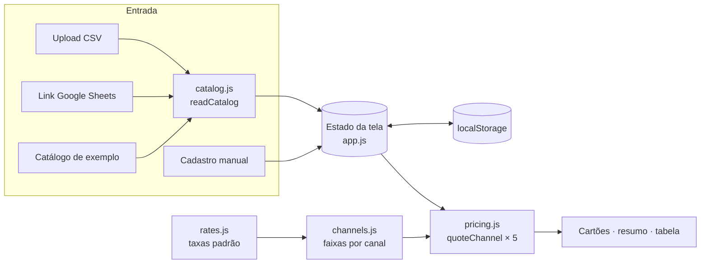

# Arquitetura

Site estático, sem build e sem backend. Roda no GitHub Pages ou em qualquer servidor de
arquivos. O código se divide em duas camadas com uma regra só: **o motor não conhece o DOM**.



## Módulos

| Arquivo                  | Camada | Responsabilidade                                                 |
| ------------------------ | ------ | ---------------------------------------------------------------- |
| `src/engine/rates.js`    | motor  | Taxas padrão com vigência. Dados, sem lógica.                    |
| `src/engine/channels.js` | motor  | Cada canal vira uma lista de faixas `{ lo, hi, pct, fixed }`.    |
| `src/engine/pricing.js`  | motor  | Solver de preço, desconto seguro, composição da venda.           |
| `src/engine/catalog.js`  | motor  | CSV, números BR/US, codificação, mescla por SKU, link do Sheets. |
| `src/ui/app.js`          | tela   | Estado, eventos e atualização do DOM.                            |
| `src/ui/rate-fields.js`  | tela   | Schema do formulário de taxas (puro, testado em Node).           |
| `src/ui/dom.js`          | tela   | `h()` para criar elementos; conteúdo sempre via `textContent`.   |
| `styles/tokens.css`      | tela   | Design tokens: cores (claro/escuro), espaço, raio, tipografia.   |
| `styles/app.css`         | tela   | Componentes e layout responsivo.                                 |

## O solver de preço

**Problema.** O preço depende da taxa, e a taxa depende do preço: a Shopee cobra 20% + R$ 4
até R$ 79,99, mas 14% + R$ 20 entre R$ 100 e R$ 199,99. Uma fórmula única erra quando o
preço calculado cai em outra faixa.

**Solução.** Dentro de uma faixa a conta é linear, então tem solução exata:

```
P = (Valor Base + fixo) ÷ (1 − percentual − imposto − margem)
```

O motor calcula `P` em **cada** faixa, sobe para o início da faixa se `P` ficou abaixo dela,
descarta se ficou acima, e escolhe o **menor** preço válido. Se nenhuma faixa tem solução
(percentual + imposto + margem ≥ 100%), o resultado é **"margem inatingível"**, não um número.

Exemplo verificado pelo motor (Valor Base R$ 81, margem 0%, Shopee):

| Faixa           | P calculado   | Cabe na faixa? |
| --------------- | ------------- | -------------- |
| R$ 8 a 79,99    | R$ 116,44     | não (acima)    |
| R$ 80 a 99,99   | R$ 122,79     | não (acima)    |
| R$ 100 a 199,99 | **R$ 127,85** | **sim**        |

Usar a primeira faixa daria R$ 116,44. Mas a R$ 116,44 a Shopee cobra 14% + R$ 20, e o
vendedor teria **R$ 9,01 de prejuízo** em cada venda.

A versão anterior do projeto usava uma iteração (calcula, olha a faixa, recalcula, até 5
vezes), que nem sempre convergia na fronteira de faixas. O solver por faixa é exato, não
tem laço e é provado por teste: **1 centavo abaixo do preço encontrado, a margem não é
atingida**.

### Desconto máximo seguro

Uma faixa mais barata pode ter taxa fixa menor e voltar a dar lucro. Por isso o desconto
seguro não é só "o preço de equilíbrio": o motor desce faixa por faixa a partir do preço de
vitrine e para no primeiro ponto em que haveria prejuízo. O teste confere que não há prejuízo
em **nenhum** preço entre o de vitrine e o com desconto máximo.

## Decisões

| Decisão                                      | Alternativa descartada | Por quê                                                                  |
| -------------------------------------------- | ---------------------- | ------------------------------------------------------------------------ |
| JavaScript + JSDoc checado pelo `tsc`        | TypeScript compilado   | Tipos estritos sem etapa de build; o Pages serve os arquivos como estão. |
| Sem framework                                | React/Next             | Uma tela só; o motor é o que importa, e fica 100% testável em Node.      |
| Barra empilhada em CSS                       | Chart.js (rosca)       | Composição do preço lida da esquerda para a direita, sem biblioteca.     |
| Cores da barra validadas por script          | escolher no olho       | Paleta passa nos testes de daltonismo e contraste nos dois temas.        |
| Cartões criados uma vez, valores atualizados | recriar a cada cálculo | Não tira o cursor de quem está digitando um preço.                       |
| `textContent` para todo dado externo         | `innerHTML`            | Nome de produto vindo de planilha nunca vira HTML (sem XSS).             |
| Dados só no navegador                        | backend com banco      | Custos são sensíveis; nada sai da máquina de quem usa.                   |

## Testes

| Suíte                      | Roda em    | O que garante                                                                                                                   |
| -------------------------- | ---------- | ------------------------------------------------------------------------------------------------------------------------------- |
| `test/pricing.test.js`     | CI + local | Varredura de custo R$ 1 a 500 em todos os canais: margem atingida, preço mínimo, nunca prejuízo com margem 0%, desconto seguro. |
| `test/catalog.test.js`     | CI + local | Números BR/US, CSV com aspas e BOM, codificação, mescla, link do Sheets.                                                        |
| `test/rate-fields.test.js` | CI + local | Todo campo do formulário aponta para uma taxa real, e toda taxa tem campo.                                                      |
| `e2e/app.test.js`          | CI + local | 13 fluxos no navegador real, incluindo responsividade em 360/768/1280 px.                                                       |
